# Ray Tracing in One Week(end)

|  |
| :-: |
| *Final Render* |

This is my journey to learn ray tracing following [Peter Shirley](https://github.com/petershirley)'s first book on the subject. 
In this readme, I will try to explain how it went, both as a reminder for myself and a help for those who choose to follow the same course in Rust. Well, I am doing this mostly for myself, but explaining what you're doing is a good way of ensuring you understand your subject.

## Resources

As I said, this is my implementation of [Peter Shirley](https://github.com/petershirley)'s guide to ray tracing. So of course I followed his book, but I also relied on previous Rust implementations:

- [Ray Tracing in One Weekend](https://raytracing.github.io/books/RayTracingInOneWeekend.html) (first of [three books](https://github.com/RayTracing/raytracing.github.io))
- [akinnane's Rust implementation](https://github.com/akinnane/RayTracingInOneWeekend)
- [Nelarius' Rust implementation](https://github.com/Nelarius/weekend-raytracer-rust)

>As a side note, I also began watching [Dr. Károly Zsolnai-Fehér](https://www.youtube.com/c/K%C3%A1rolyZsolnai)'s course on YouTube ([TU Wien Rendering / Ray Tracing Course](https://youtube.com/playlist?list=PLujxSBD-JXgnGmsn7gEyN28P1DnRZG7qi)). I was at the 12th video by the end of this project.

## Why Another Rust Ray Tracing in One Weekend?

Why [Ray Tracing in One Weekend](https://raytracing.github.io/books/RayTracingInOneWeekend.html)? And why Rust? 
As I was learning Rust by myself, I wondered what kind of project I could do to practice. I always had an interest in CG graphics but never went further than some basic Blender, Unity and a few vulgarisation videos. I though it could be interesting to learn Rust through a 3D engine and [Ray Tracing in One Weekend](https://raytracing.github.io/books/RayTracingInOneWeekend.html) seems like a good start.

The reason I thought it was important to write this is to give you some context. I have some theoretical knowledge about CGI, but I am a **complete beginner** in both **computer graphics** and **Rust**. My only experience with the language come from the [rustlings](https://github.com/rust-lang/rustlings) exercises which I haven't even finished before getting to work. 

What I am trying to say is instead of an efficient implementation expect some weird experiments.

>I wrote this readme after completing this project over a period of one week. As I didn't use git from the start nor progressed in a methodical way some early code issue description and code illustration may be inaccurate.

# The journey

* [The first image](#the-first-image-ppm)
* [Vec3 implementation (I should have use TDD)](#vec3-implementation-i-should-have-use-tdd)
* [Hittable abstraction with Traits](#hittable-abstraction-with-traits)
* [Utilities for Rust](#utilities-for-rust)
    * [Common Constants & Utility Functions](#common-constants--utility-functions)
    * [Some Random Number Utilities](#some-random-number-utilities)
* [Materials through enums](#materials-through-enums)
    * [Diffuse implementation](#diffuse-implementation)
    * [Metal implementation](#metal-implementation)
    * [Dielectric implementation](#dielectric-implementation)
        * [Refraction Vector Formulas Demonstration](#refraction-vector-formulas-demonstration)
        * [The refraction bug](#the-refraction-bug)
* [Multithreading with Rayon](#multithreading-with-rayon)
* [FOV Distortion, Movable Camera & Blur](#fov-distortion-movable-camera--blur)
* [Final render](#final-render)
* [Closing thoughts](#closing-thoughts)

## The first image (PPM)

The first step was to create an image. For simplicity, the [book](https://raytracing.github.io/books/RayTracingInOneWeekend.html) uses the [PPM](https://en.wikipedia.org/wiki/Netpbm#PPM_example) format. As a text description of an image, it is indeed easy to manipulate.
>The image renders were [PPM](https://en.wikipedia.org/wiki/Netpbm#PPM_example) files, but I converted them to PNG for display. You can find the renders [here (./render)](./renders/).

At first I relied on the [format!](https://doc.rust-lang.org/std/macro.format.html) macro to concatenate the [strings](https://doc.rust-lang.org/std/string/index.html) which make up the [PPM](https://en.wikipedia.org/wiki/Netpbm#PPM_example) file with the new pixels at every loop. However, it proved to grow very slow with higher resolutions (we are talking about seconds for a simple color gradient).
```Rust
let mut render = format!("P3\n{} {}\n255", img_width, img_height);

for j in (0..img_height).rev() {
    for i in 0..img_width {
        // Color logic
        render = format!("{render}\n{r} {g} {b}");
    }   
}
render
```

Although I really should dive deeper into string manipulation in Rust, I worked around the issue by using a [Vec\<String>](https://doc.rust-lang.org/std/vec/index.html) instead and joining it at the end.
```Rust
let mut render = Vec::new();
render.push(format!("P3\n{} {}\n255", img_width, img_height));

for j in (0..img_height).rev() {
    for i in 0..img_width {
        // Color logic
        render.push(format!("{r} {g} {b}"));
    }
}
render.join("\n")
```

>I use ranges for my loops, mainly for readability and laziness. But from my understanding it shouldn't cost much if any performance ([Comparing Performance: Loops vs. Iterators](https://doc.rust-lang.org/book/ch13-04-performance.html)).

## Vec3 implementation (I should have use TDD)

Implementing Vec3 is straight forward. Rust operators are *"syntactic sugar for method calls"* ([Operator Overloading](https://doc.rust-lang.org/rust-by-example/trait/ops.html)) so as long as you know which [trait](https://doc.rust-lang.org/rust-by-example/trait.html) correspond to which operator it is easy to implement them. At least that's what I thought.

The thing is, there are many operators to override if you want a complete coverage and due to some quick copy and paste I mistakenly put **'y's** in place of **'z's** in some places.

> The "Hello world" background rendering showcased a different color as well as some weird round effects on the center of the picture. I could fix the artefact at the center by not normalizing (to unit vector) the raycast, but I didn't investigate the discoloration further. 
>
>That was dumb. Always question why your code does not give you the expected result.

I only caught the real issue when I tried to display the first sphere as it resulted in weird abstract pieces :

|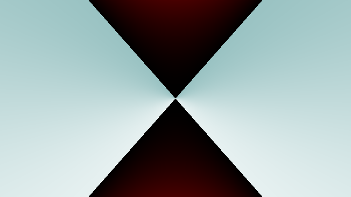|
|:--:|
| *"Ceci n'est pas une sphère - Or how to fail your ray tracer"<br>Nicolas Guillaume Soulié* |

After some time, I managed to find the mistake using [unit tests](https://doc.rust-lang.org/book/ch11-01-writing-tests.html). So I do advise you to use [unit tests](https://doc.rust-lang.org/book/ch11-01-writing-tests.html) and/or [TDD (Test Driven Development)](https://en.wikipedia.org/wiki/Test-driven_development#Test-driven_development_cycle) for straight forward yet important part of your code like Vec3. 

> I have initially written my own tests for dot and cross products. However, I didn't expect typos on simpler operations. To debug faster I "stole" [Nelarius' unit tests](https://github.com/Nelarius/weekend-raytracer-rust/blob/master/src/vec3.rs). However, one mistake did manage to pass all the tests. I caught it when I started to deal with multi-sampling anti-aliasing as it whitened the image based on the number of rays.

|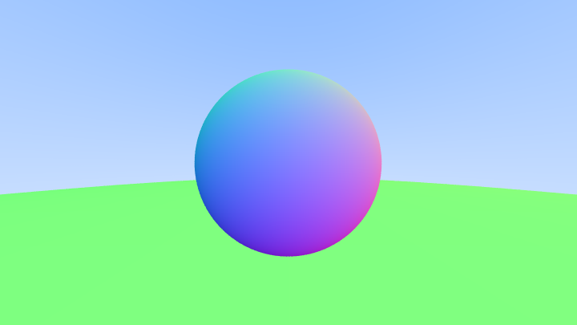|
|:--:|
|Normals after correction|

## Hittable abstraction with Traits

In Rust there is no inheritance. Instead the language uses [Traits implementations](https://doc.rust-lang.org/book/ch10-02-traits.html). 

>"Traits are similar to a feature often called interfaces in other languages, although with some differences."
>
>[The Rust "book", *Traits: Defining Shared Behavior*](https://doc.rust-lang.org/book/ch10-02-traits.html)

To abstract [Hittables](./src/raytracer/hittable.rs) in Rust, [traits](https://doc.rust-lang.org/book/ch10-02-traits.html) seem like the implementation closest to a parent class in C++. You have to use the [dyn](https://doc.rust-lang.org/rust-by-example/trait/dyn.html?highlight=dyn#returning-traits-with-dyn) keyword to explicit that you use dynamic types and wrap the Hittables structs in your list in smart pointers (like [Box](https://doc.rust-lang.org/book/ch15-01-box.html?highlight=box#enabling-recursive-types-with-boxes) or [Arc](https://doc.rust-lang.org/book/ch16-03-shared-state.html?highlight=arc#atomic-reference-counting-with-arct)).

```Rust
// Dyn type in smart pointer for list (Vec)
pub struct HittableList {
    pub objects: Vec<Arc<dyn Hittable>>,
}
// Dyn type used in functions/methods prototypes
pub fn render(world: &(dyn Hittable), samples: u16, max_depht: u16 ) -> String;
```

>In functions, we can only pass [references](https://doc.rust-lang.org/book/ch04-02-references-and-borrowing.html?highlight=references#references-and-borrowing) to a dynamic type. To quote the Rust compiler:
>
>*"Function arguments must have a statically known size, borrowed types always have a known size: `&`"*

Another possible implementation would be to use Rust [enums](https://doc.rust-lang.org/book/ch06-01-defining-an-enum.html) as a type wrapper. However, in my opinion, this implementation would make the addition of new hittable classes more tedious so I chose against it. I still used this approach with [materials](./src/raytracer/hittable/material.rs) if you are interested.

## Utilities for Rust

Multiple of the constants and utility functions needed in the [book](https://raytracing.github.io/books/RayTracingInOneWeekend.html#surfacenormalsandmultipleobjects/commonconstantsandutilityfunctions) are already available in Rust. You just need to import some of them.

### Common Constants & Utility Functions

```Rust
// Maximum float (f64 in my case)
f64::INFINITY

// PI (not needed)
std::f64::consts::PI

// Degree to radians
let degree: f64 = 90.0;
let radian: f64 = degree.to_radians();
```

### Some Random Number Utilities

```Rust
// Import 
use rand::{thread_rng, Rng};

// Get a reference to the thread-local generator
let mut rng: ThreadRng = thread_rng();

// Generate a number in range
let random_number = rng.gen_range(min..max);
```

## Materials through enums

For the materials implementation, I chose to rely on an [enum](https://doc.rust-lang.org/book/ch06-01-defining-an-enum.html) wrapper. The scatter method of the [enum](https://doc.rust-lang.org/book/ch06-01-defining-an-enum.html) use a [match control flow](https://doc.rust-lang.org/book/ch06-02-match.html) to call the scatter method of the wrapped material type.

```Rust
pub enum Material {
    Lambertian(Lambertian),
    // ...
}

impl Material {
    pub fn scatter(&self, r_in: &Ray, rec: &mut HitRecord, rng: &mut ThreadRng) ->  (Vec3, Ray) {
        match self {
            Material::Lambertian(l) => l.scatter(rec, rng),
            // ...
        }
    }
}
```
### Diffuse implementation

The diffuse [material implementation](./src/raytracer/hittable/material.rs) was relatively without issue. At first my results were very dark compared to the [book](https://raytracing.github.io/books/RayTracingInOneWeekend.html#diffusematerials/limitingthenumberofchildrays), but I couldn't find why. After the shadow acne fix I obtained closer results.

|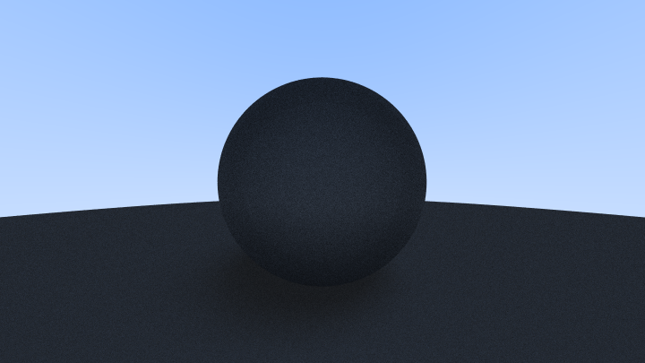| 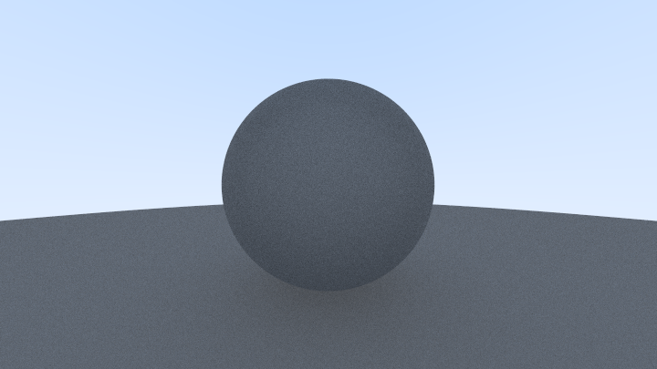||
|:---:|:---:|:---:|
|Diffuse|Gamma correction|Shadow acne fix|

|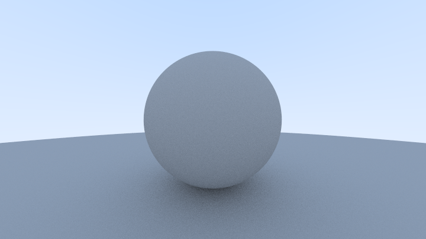|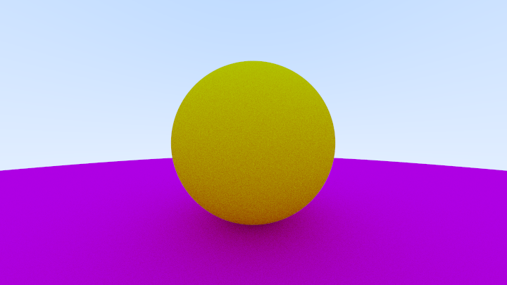|
|:--:|:--:|
|Lambertian diffuse|Colored lambertian diffuse|

### Metal implementation

Implementing a metallic [material](./src/raytracer/hittable/material.rs) was uneventful. I already explained my abstraction of [materials](./src/raytracer/hittable/material.rs) previously so all I can give you are pretty visuals:

|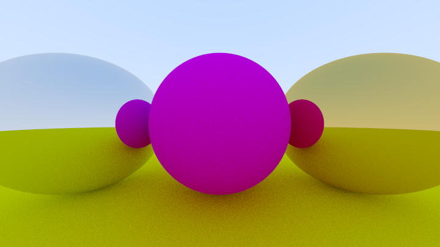|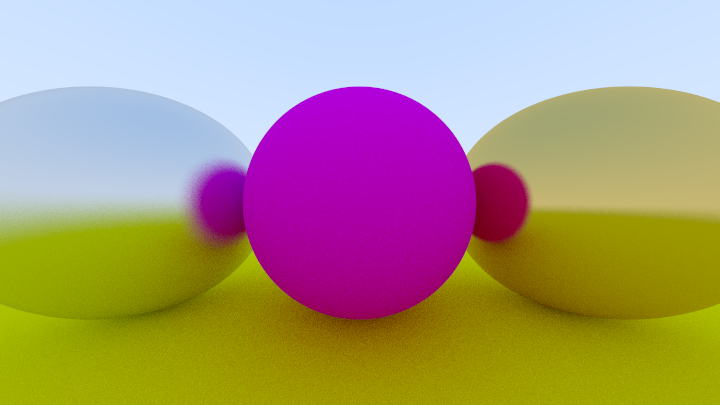|
|:--:|:--:|
|Metallic reflection|Fuzzy reflection|

### Dielectric implementation

Implementing a dielectric [material](./src/raytracer/hittable/material.rs) proved to be challenging. Well, first I decided to provide an actual proof of the formulas used for computing the refracting ray. The second challenge came from a bug I spent hours searching.

#### Refraction Vector Formulas Demonstration

The [book](https://raytracing.github.io/books/RayTracingInOneWeekend.html#dielectrics/snell'slaw) gives us formulas for computing $R^′$ without telling us how it works. *"You can go ahead and prove this for yourself if you want, but we will treat it as fact and move on."* Well, here I will try to prove it.

We want to demonstrate: 

$$R^′\_{⊥}=\frac{η}{η′}⋅(R+cosθn)$$

$$R^′\_{∥}=−\sqrt{1−|R^′\_{⊥}|^2}N$$

|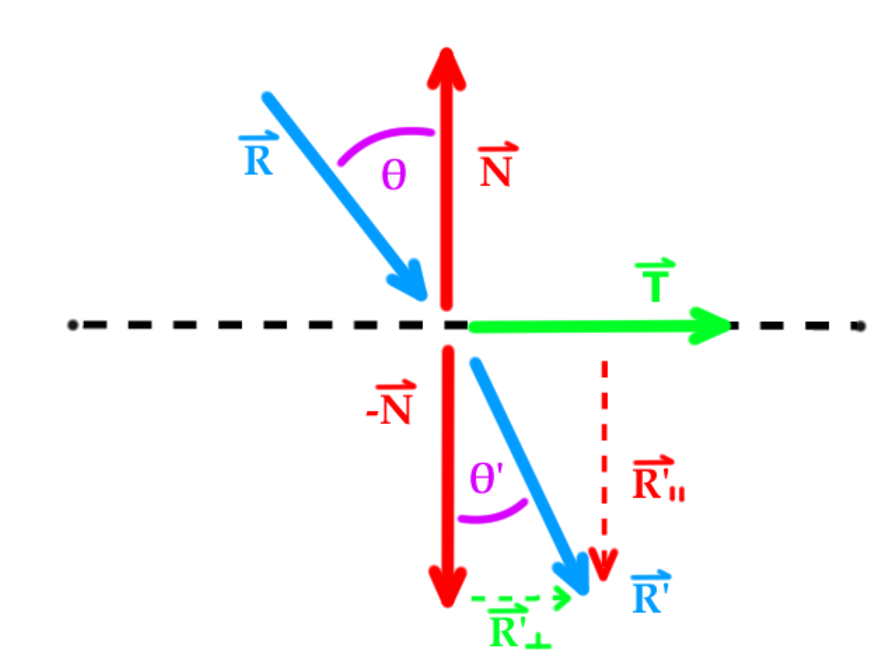|
|:--:|
| Refraction|

We have $N$, $T$, $R$ and $R^′$ of unit length, with $T$ perpendicular to $N$. We also know that:

$$R = R\_{⊥}+R_{∥}$$

$$R^′=R^′\_{⊥}+R^′\_{∥}$$

$$sinθ^′=\frac{η}{η′}⋅sinθ$$

With $\_{⊥}$ and $\_{∥}$ respectively indicating the vector is perpendicular/parallel to $N$ :

$$
\begin{cases}
R\_{⊥} = Tsinθ\\
R\_{∥} = -Ncosθ\\
\end{cases}
\begin{cases}
R^′\_{⊥} = Tsinθ^′\\
R^′\_{∥} = -Ncosθ^′\\
\end{cases}
$$

Therefor we can define ${R^′\_{⊥}}$ based on ${R\_{⊥}}$:

$$R^′\_{⊥} = Tsinθ^′$$

$$R^′\_{⊥} = \frac{η}{η′}⋅Tsinθ$$

$$R^′\_{⊥} = \frac{η}{η′}⋅R\_{⊥}$$

And since:

$$R\_{⊥} = R - R\_{∥}$$

$$R\_{⊥} = R + Ncosθ$$

We have: 

>$$R^′\_{⊥} = \frac{η}{η′}⋅(R + Ncosθ)$$

Next we can express $R^′\_{∥}$ using $R^′\_{⊥}$ thanks to trygonometry $(cos^2θ + sin^2θ = 1)$:

$$R^′\_{∥} = -Ncosθ^′$$

$$R^′\_{∥} = -N⋅\sqrt{cos^2θ^′}$$

$$R^′\_{∥} = -N⋅\sqrt{(1 - sin^2θ^′)}$$

Because $|R^′\_{⊥}| = |T|sinθ^′ = sinθ^′$ since $T$ is of unit length:

>$$R^′\_{∥} = -N\sqrt{1 -|R^′\_{⊥}|^2}$$

#### The refraction bug

Dielectric too should be rather simple to implement by following the [book](). Alas, my old stealthy mistake surfaced in all its glory. Basically, while implementing refractions, I faced a bug which turned my glass ball black. 

|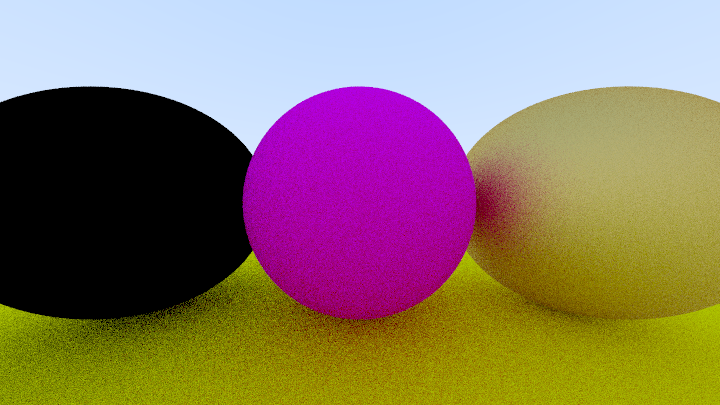|
|:--:|
| Where is refraction?|

I spent hours checking my code. I followed the debugger step by step, surveilling how and where the rays were cast, visualising them with a pen and paper, to understand what was happening.

>If you are unfamiliar with [breakpoints](https://en.wikipedia.org/wiki/Breakpoint), they allow you to pause execution of a program at a chosen instruction. Then you can check the [stack trace](https://en.wikipedia.org/wiki/Stack_trace) as well as variable values. 
>
>If you want to follow a ray on a specific material without stopping at each ray cast, put your [breakpoint](https://en.wikipedia.org/wiki/Breakpoint) on said material call (like its ```fn scatter()``` method) and then look at the [stack trace](https://en.wikipedia.org/wiki/Stack_trace), or progress step by step onward.

Looking at the ray values and hit distances, I realised the first scattered ray would detect a hit at its origin. Then every successive refraction would repeat the same mistake until depth reached its maximum. Hence the black final color.

The issue came from an oversight in the sphere hit detection. While I did check both roots for intersection, I created a new variable for the second root inside the first `if` statement which was then discarded. So if the second root was the right one, I still used the first one. 

That was a failed attempt at [shadowing](https://doc.rust-lang.org/book/ch03-01-variables-and-mutability.html#shadowing) on my part. Well, at least I now know how it works. I hope so. 

```Rust
let root = (-half_b - sqrtd) / a;           // Define root
if root < t_min || t_max < root {           
    let root = (-half_b + sqrtd) / a;       // (INNER) Shadow the root
    if root < t_min || t_max < root {
        return false;
    }
}                                           // The second root goes out of scope
                                            // The inner shadowing loose its effect
```
Once fixed it look like this:
```Rust
let mut root = (-half_b - sqrtd) / a;       // Define a mutable root
if root < t_min || t_max < root {
    root = (-half_b + sqrtd) / a;           // Store new root in mutable root
    if root < t_min || t_max < root {
        return false;
    }
}                                           // The second root is still in scope
```

|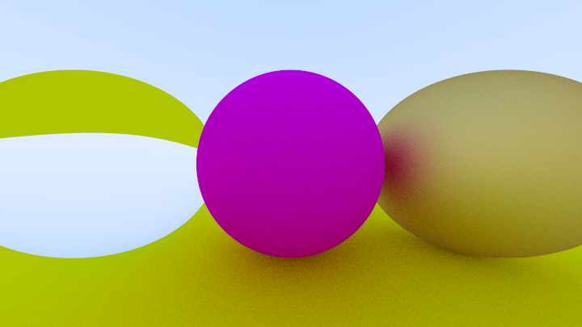|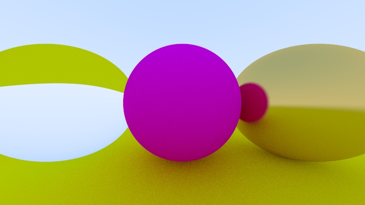|
|:--:|:--:|
|Refraction working as it should<br>(with fuzzy metal)|Refraction working as it should<br>(with less fuzzy metal)|

||
|:--:|
|Schlick approximation|

## Multithreading with Rayon

The rendering loop in other Rust projects ([akinnane](https://github.com/akinnane/RayTracingInOneWeekend) and [Nelarius](https://github.com/Nelarius/weekend-raytracer-rust)) used an iterator in a way I never saw. 
Doing a bit of research I learned that they used [rayon](https://docs.rs/rayon/latest/rayon/) for easy multithreading. 
At that point, rendering started to slow down so I decided to try it myself. 
While it is fairly simple to use, I still had to face a few difficulties.

For an object to be passed around threads, it needs to implement the traits [Send](https://doc.rust-lang.org/std/marker/trait.Send.html) and [Sync](https://doc.rust-lang.org/std/marker/trait.Sync.html). 
Those traits are automatically implemented when the compiler determines it’s appropriate. 

>"Any type composed entirely of `Send` types is automatically marked as `Send` as well. Almost all primitive types are `Send`, aside from raw pointers".
>
>"Similar to `Send`, primitive types are `Sync`, and types composed entirely of types that are `Sync` are also `Sync`."
>
>[The Rust "book", *Extensible Concurrency with the Sync and Send Traits*](https://doc.rust-lang.org/book/ch16-04-extensible-concurrency-sync-and-send.html)

Thanks to that, my `structs` already implements [Send](https://doc.rust-lang.org/std/marker/trait.Send.html) and [Sync](https://doc.rust-lang.org/std/marker/trait.Sync.html). 
However, that is not the case for [dyn](https://doc.rust-lang.org/rust-by-example/trait/dyn.html?highlight=dyn#returning-traits-with-dyn) Hittable `structs`, whose true type is only known at runtime. 
Therefor, I had to precise that I wanted my `structs` to implement [Send](https://doc.rust-lang.org/std/marker/trait.Send.html) and [Sync](https://doc.rust-lang.org/std/marker/trait.Sync.html) in my definitions. 
I also changed my [Box](https://doc.rust-lang.org/book/ch15-01-box.html#enabling-recursive-types-with-boxes)  smart pointers to [Arc](https://doc.rust-lang.org/book/ch16-03-shared-state.html#atomic-reference-counting-with-arct).

```Rust 
// HittableList became a vec of smart pointers to Hittable, Send and Sync structs
pub struct HittableList {
    pub objects: Vec<Arc<dyn Hittable + Send + Sync>>,
}

// render now asks for Sync Hittable structs
pub fn render(world: &(dyn Hittable + Sync), // ...
    ) -> String;
```

I also used an [Arc](https://doc.rust-lang.org/book/ch16-03-shared-state.html#atomic-reference-counting-with-arct)<[Mutex](https://doc.rust-lang.org/book/ch16-03-shared-state.html#using-mutexes-to-allow-access-to-data-from-one-thread-at-a-time)> to track the progress of the render despite the chaotic nature of multithreading. 
It probably slows down the process, but since I never really measured the render time I cannot judge the loss or gain of this whole implementation. 
So long as I learn new things I am satisfied, but I really should look into performance measuring in the future.

|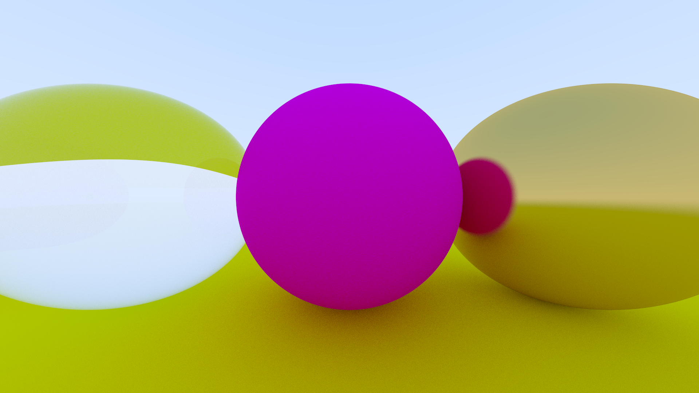|
|:--:|
|No changes in the result<br>Multithreading is working|

## FOV Distortion, Movable Camera & Blur

I don't have much to say about those last few steps. 
I had no issue and the port from the [book](https://raytracing.github.io/books/RayTracingInOneWeekend.html#positionablecamera) C++ implementation to Rust is too simple to involve another architecture choice.

|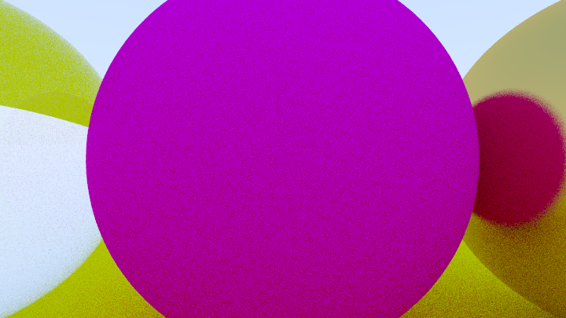|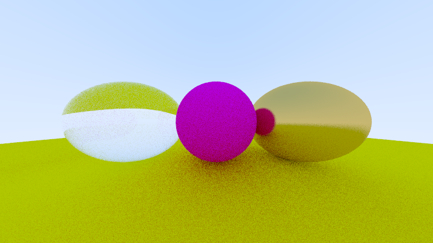|
|:--:|:--:|
|FOV 50|FOV 120|

However, I do find the distortion in high FOV a bit weird, especially in the 160 and further (I should have saved those...). 
I believe it is due to the way we cast our rays from an origin to a plane using a constant distance in the `x` and `y` axis for pixels.
Because of that we have smaller angular differences between neighboring pixels at the edges. 
The higher the FOV the greater the angular step differ between the center and the borders.
||
|:--:|
|[Ray Tracing in One Weekend, *"Figure 3: Camera geometry"*](https://raytracing.github.io/books/RayTracingInOneWeekend.html#rays,asimplecamera,andbackground/sendingraysintothescene)|


Or maybe I am just not used to high FOV and a camera ray cast with constant angular step between nearby pixels might just look as weird.
I should try it out, but for now I get results that match the [book](https://raytracing.github.io/books/RayTracingInOneWeekend.html#positionablecamera/cameraviewinggeometry) so I will keep plane projection.

|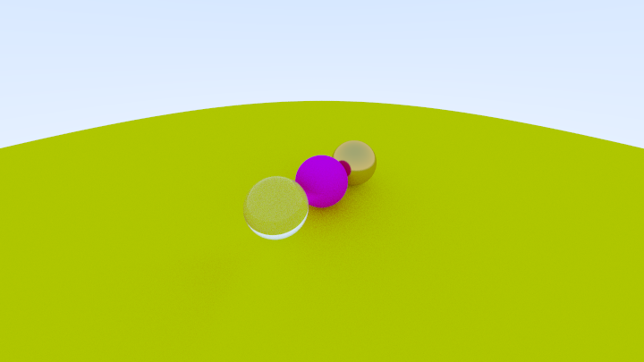|
|:--:|
|FOV 90|

||
|:--:|
|FOV 20|

|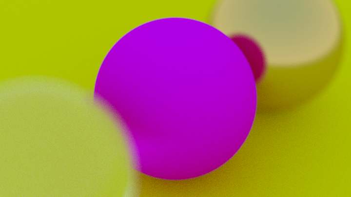|
|:--:|
|FOV 20, Apperture 0.5|


## Final render

|Test Render|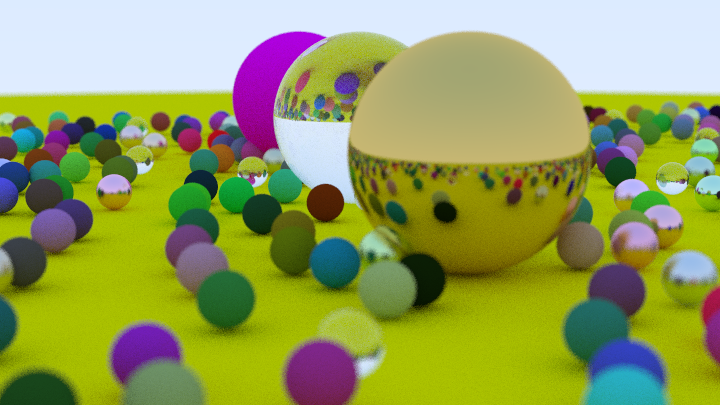|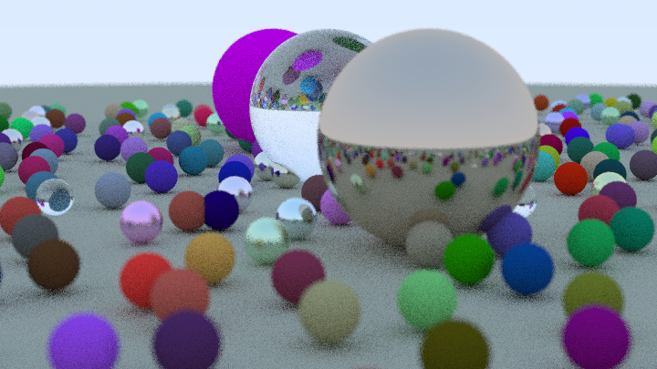|
|:--:|:--:|:--:|
|Resolution|720x405px|720x405px|
|Samples| 128/px|16/px|
|Depth| 50| 16|
|FOV| 20| 20|
|Apperture| 0.1| 0.1|

|Final Render|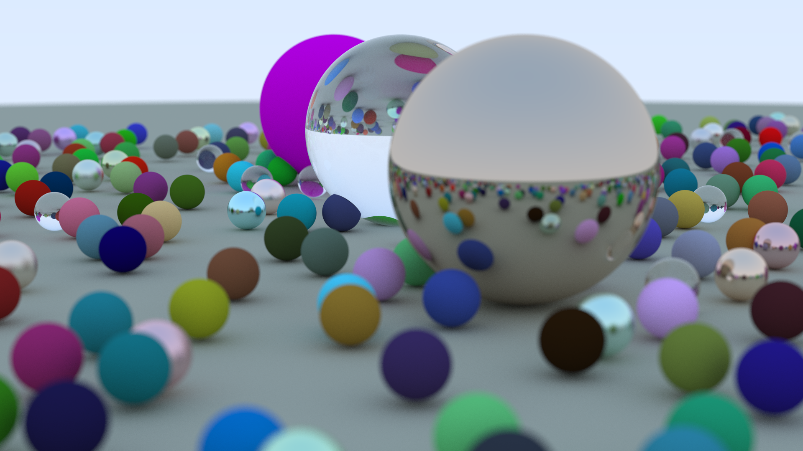|
|:--:|:--:|
|Resolution|1920x1080px|
|Samples| 512/px|
|Depth| 64| 
|FOV| 20| 
|Apperture| 0.1| 

>The final render took approximately 5 hours to render with an `i7 4770k` (16Go of RAM). 
>Thanks to [rayon](https://docs.rs/rayon/latest/rayon/), all 8 threads showed a 100% utilisation. 
>
>While other programs were running during the process, the rendering still used more than 90% of CPU utilisation.

## Closing thoughts
